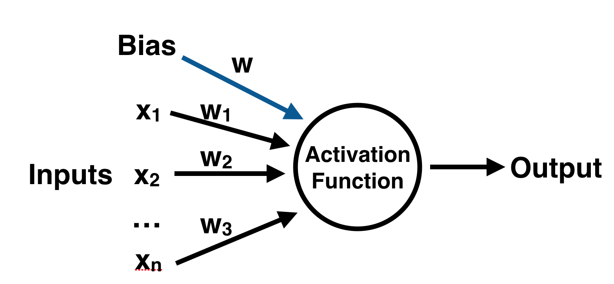
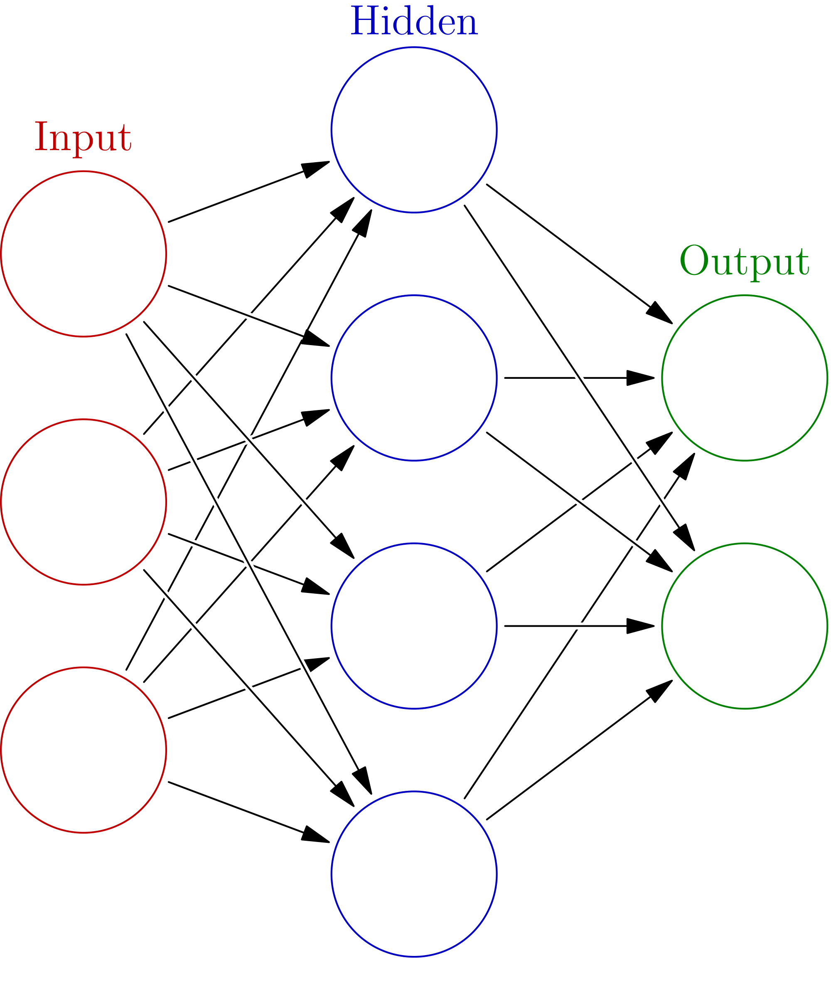

# A Beginner’s Guide to Neural Networks in Python and SciKit Learn 0.18
Tutorial with SciKit-Learn, Anaconda and iPython Notebook for Wine Fraud 
Based on the tutorial [Building a Neural Network in Python](https://www.springboard.com/blog/beginners-guide-neural-network-in-python-scikit-learn-0-18/)

## SciKit-Learn
In order to follow along with this tutorial, you’ll need to have the latest version of SciKit Learn (>0.18) installed! It is easily installable either through pip or conda, but you can reference the official installation documentation for complete details on this.
[Document](http://scikit-learn.org/stable/install.html)

## Anaconda and iPython Notebook
One easy way of getting SciKit-Learn and all of the tools you need to have to do this exercise is by using Anaconda’s iPython Notebook software. This [tutorial](https://www.safaribooksonline.com/blog/2013/12/12/start-ipython-notebook/) will help you get started with these tools so you can build a neural network in Python within.

## Data
For this analysis we will cover one of life’s most important topics – Wine! All joking aside, wine fraud is a very real thing. Let’s see if a Neural Network in Python can help with this problem! We will use the wine data set from the UCI Machine Learning Repository. It has various chemical features of different wines, all grown in the same region in Italy, but the data is labeled by three different possible cultivars. We will try to build a model that can classify what cultivar a wine belongs to based on its chemical features using Neural Networks. You can get the data here.
[Wine Data](https://archive.ics.uci.edu/ml/datasets/Wine)

## Neural Networks
Neural Networks are a machine learning framework that attempts to mimic the learning pattern of natural biological neural networks: you can think of them as a crude approximation of what we assume the human mind is doing when it is learning. Biological neural networks have interconnected neurons with dendrites that receive inputs, then based on these inputs they produce an output signal through an axon to another neuron. We will try to mimic this process through the use of Artificial Neural Networks (ANN), which we will just refer to as neural networks from now on. Neural networks are the foundation of deep learning, a subset of machine learning that is responsible for some of the most exciting technological advances today! The process of creating a neural network in Python begins with the most basic form, a single perceptron. Let’s start by explaining the single perceptron!

## The Perceptron
Let’s start our discussion by talking about the Perceptron! A perceptron has one or more inputs, a bias, an activation function, and a single output. The perceptron receives inputs, multiplies them by some weight, and then passes them into an activation function to produce an output. There are many possible activation functions to choose from, such as the logistic function, a trigonometric function, a step function etc. We must also make sure to add a bias to the perceptron, a constant weight outside of the inputs that allows us to achieve better fit for our predictive models. Check out the diagram below for a visualization of a perceptron:

Once we have the output we can compare it to a known label and adjust the weights accordingly (the weights usually start off with random initialization values). We keep repeating this process until we have reached a maximum number of allowed iterations, or an acceptable error rate.

To create a neural network, we simply begin to add layers of perceptrons together, creating a multi-layer perceptron model of a neural network. You’ll have an input layer which directly takes in your data and an output layer which will create the resulting outputs. Any layers in between are known as hidden layers because they don’t directly “see” the feature inputs within the data you feed in or the outputs. For a visualization of this check out the diagram below (source: Wikipedia).

